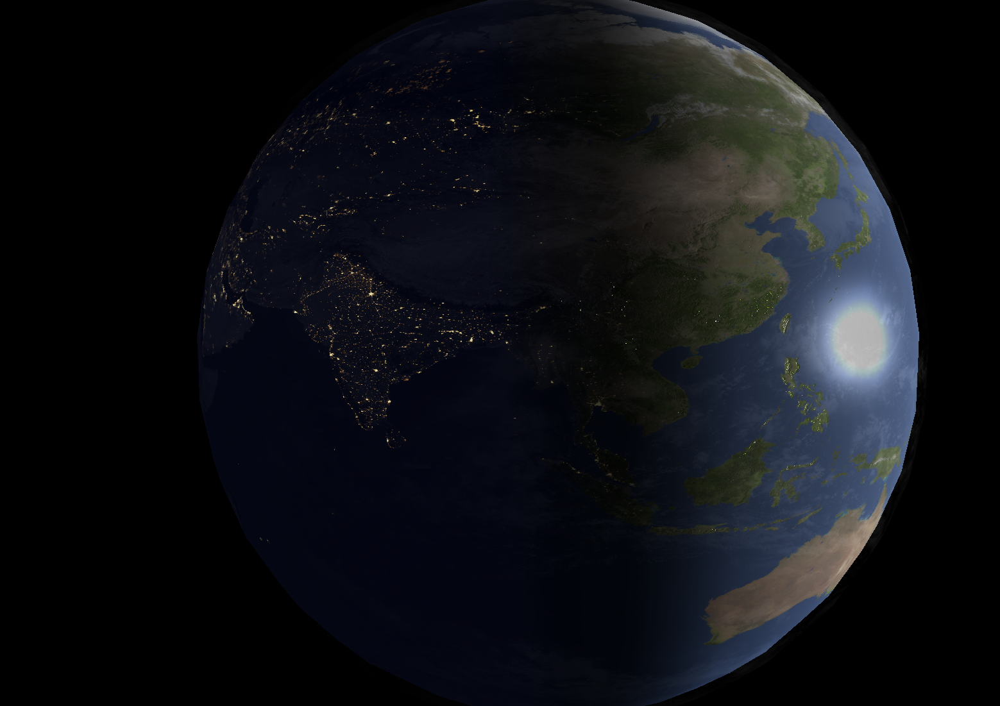
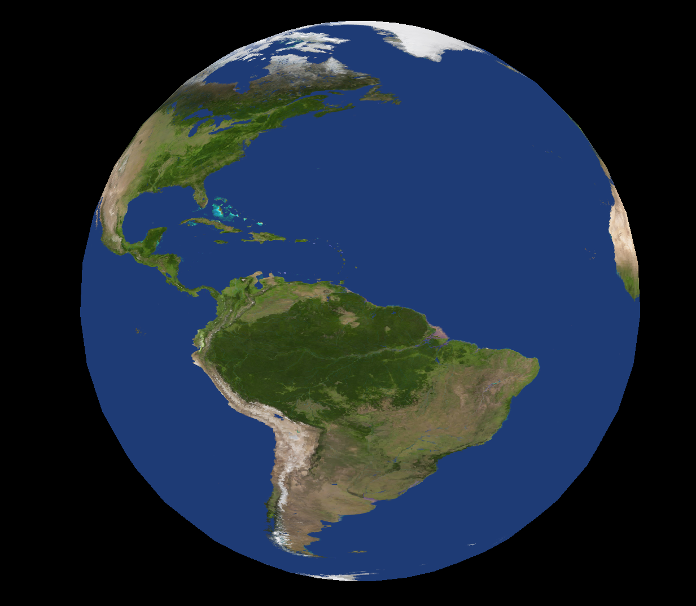
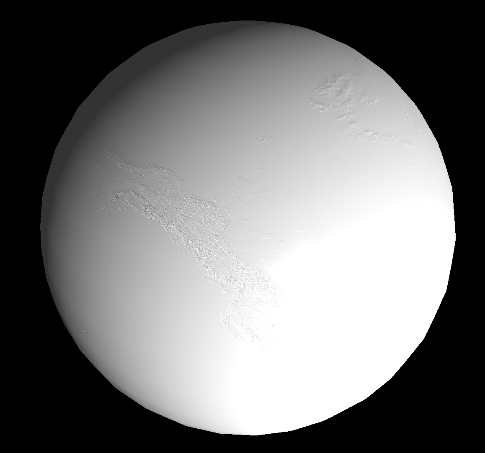
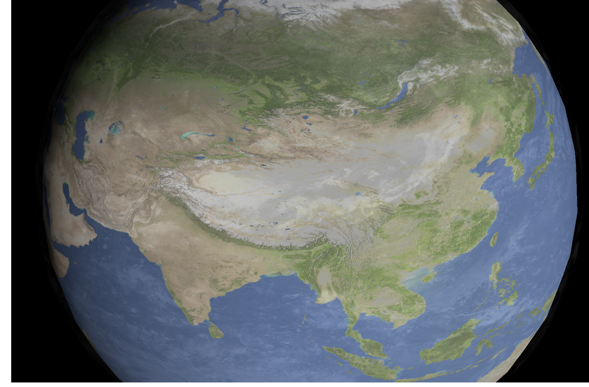
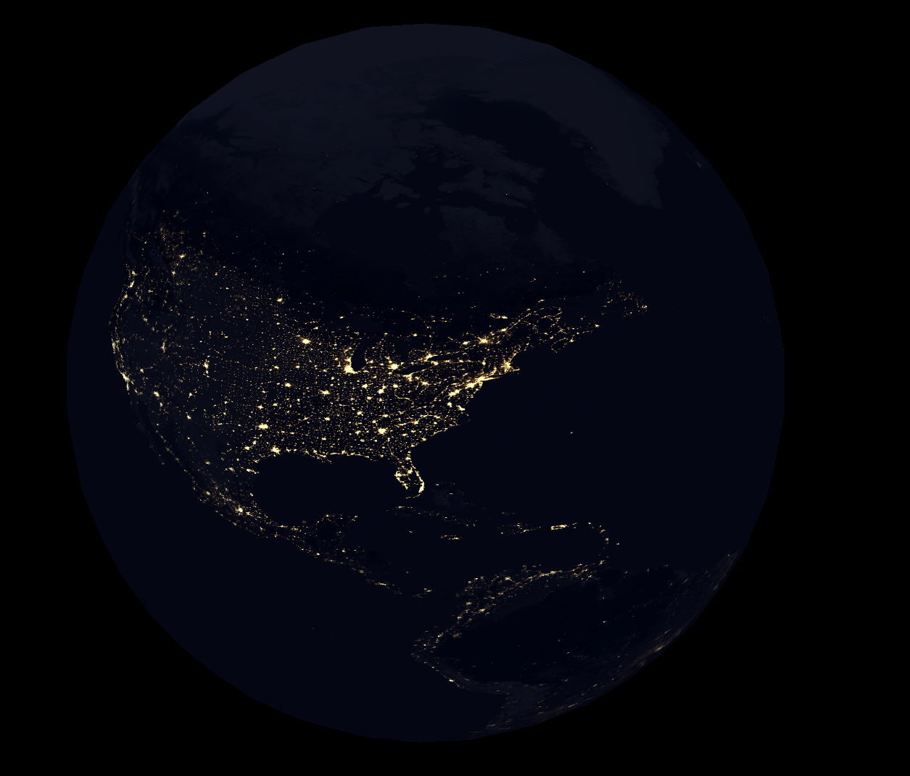
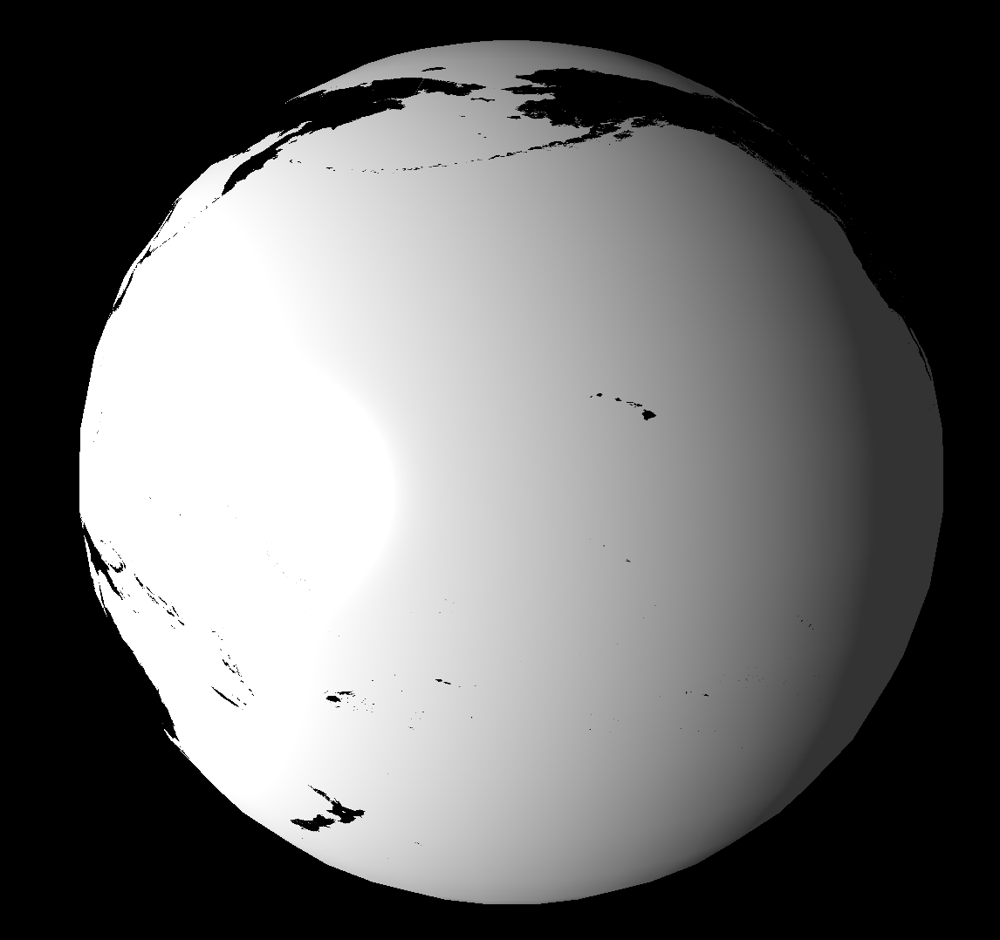
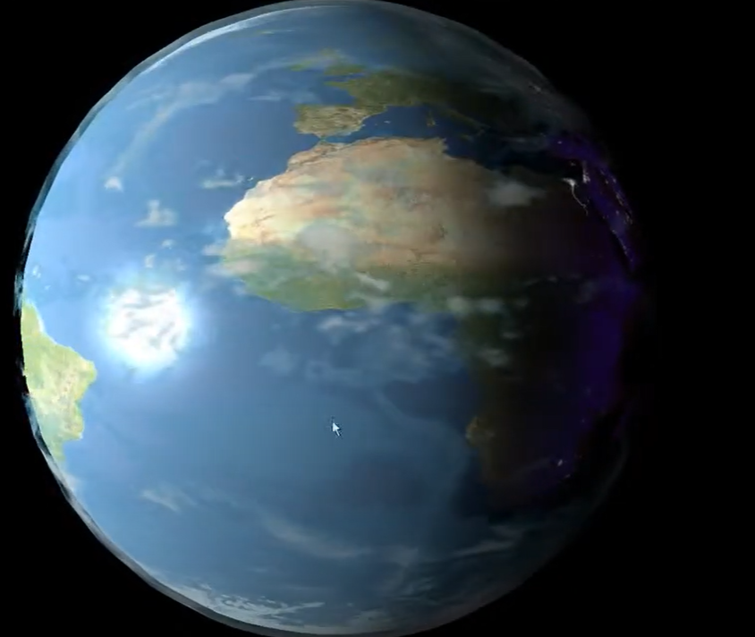

# EarthGLDemo
Demonstration of handling texture mapping, bump mapping, lighting, blending, specular and normal maps.

It has dependencies on freeglut (https://freeglut.sourceforge.net/), glew32 (https://glew.sourceforge.net/basic.html), and a library written by Edward Angel (https://www.cs.unm.edu/~angel/BOOK/INTERACTIVE_COMPUTER_GRAPHICS/SIXTH_EDITION/) used in Computer Graphics course, and DevIL image library (https://openil.sourceforge.net/).  The textures downloaded from https://www.solarsystemscope.com/textures/.  These are not original textures using during development.  It was developed for school project in 2011.

Controls:  

 - a and s keys zoom in and out the scene  
 - v key switches different maps

Screenshots:

 - Blended.

 

 - Surface

 

- Bump map.

  
 - Day with clouds and bumps.
   

 - Night.

 - Specular.

 - This is a video from original development  
[Watch on YouTube](https://youtu.be/nXvglBN2ddM)  
 
  

   
